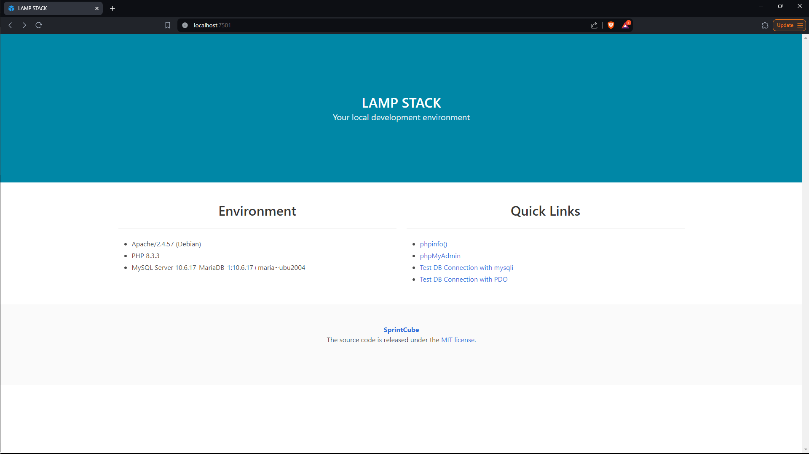

# LAMP stack built with Docker Compose

## Preamble


A basic LAMP stack environment built using Docker Compose. It consists of the following:
- Apache
- PHP
  - WordPress v6.4.3 (06.03.2024)
- MySQL
- phpMyAdmin
- Redis

For more information see the [source repository](https://github.com/sprintcube/docker-compose-lamp).<br>
Additionally an [alternative approach](https://medium.com/@mikez_dg/how-to-set-up-a-simple-lamp-server-with-docker-images-in-2023-9b0e24476ec6).


## Installation & start
- Clone this repository on your local computer.
- configure .env as needed.
- Run the `docker compose up -d`.

### Windows
- First you need to install `wsl`. [Here](https://learn.microsoft.com/en-us/windows/wsl/install) are the installation directives.
- Next install `docker`. [Here](https://docs.docker.com/desktop/install/windows-install/) are the installation directives.
- Finally run the following commands in the console.
```shell
git clone https://github.com/tapmeppe-work/dockeroolamp.git
cd __PATH__/__TO__/__ENVIRONMENT__/
wsl
cp .env.template .env
docker compose up -d
```

### Linux & Mac
- First you need to install `docker`. The installation directives can be found here:
  - [Linux](https://docs.docker.com/desktop/install/linux-install/)
  - [Mac](https://docs.docker.com/desktop/install/mac-install/)
- Finally run the following commands in the terminal.
```shell
git clone https://github.com/tapmeppe-work/dockeroolamp.git
cd __PATH__/__TO__/__ENVIRONMENT__/
cp .env.template .env
docker compose up -d
```

### What & where is the environment (__PATH__/__TO__/__ENVIRONMENT__/)
It represents the directory in the Docker repository has been cloned via the command `git clone`. So basically the directory in which __THIS__ `README.md` is located.

### docker with non-default yaml files
- To start (and stop) a docker image with a yaml file other than *docker-compose.yml* and *docker-compose.yaml*, use the following command(s).
```shell
docker compose -f __PATH_TO_YAML_FILE__ up -d
docker compose -f __PATH_TO_YAML_FILE__ down
```
- For example starting (and stopping) a docker image containing a redis server would look as follow:
```shell
docker compose -f docker-compose.redis.yml up -d
docker compose -f docker-compose.redis.yml down
```

## User interfaces
The apache server is configured to run on port 7501. Use following default credentials.
- URL: http://localhost:7501/

phpMyAdmin is configured to run on port 7502. Use following default credentials.
- URL: http://localhost:7502/ 
- Username: root  
- Password: qw3rtzu10p

---
### @since PM (07.03.2024)
